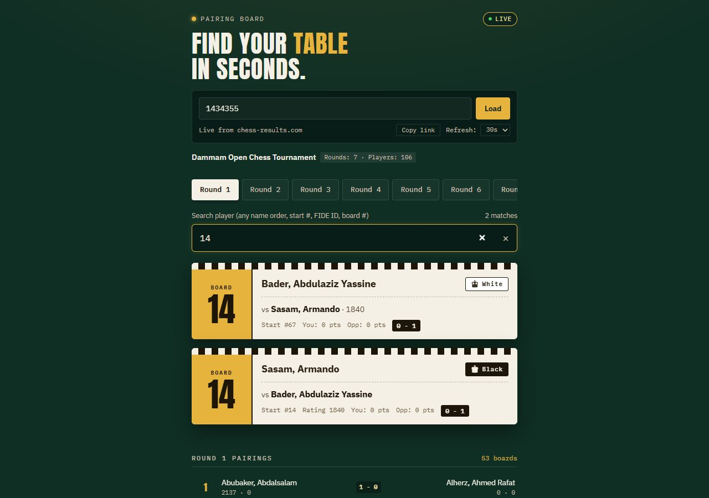
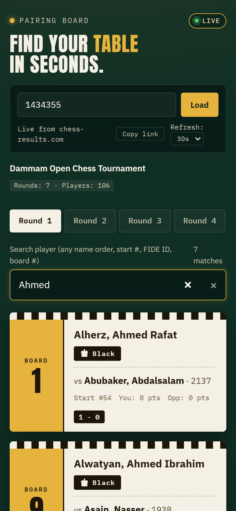

# Pairing Board — find your table in seconds

A live viewer for chess tournament pairings from [chess-results.com](https://chess-results.com). Paste a tournament link or ID, type your name, and it shows only what a player needs: **board number, colour, opponent, rating, points and result**.

I built it after watching players at tournaments crowd around printed pairing sheets and scroll through huge tables on their phones looking for their own board.

**Live demo:** https://chessresults.pageui.workers.dev/#1434355

| Desktop | Phone |
|---|---|
|  |  |

## Features

- **Paste anything:** a full chess-results URL or just the tournament number (`tnr`).
- **Round tabs:** available rounds are detected automatically.
- **Order-agnostic player search:** matches `John Doe`, `Doe John`, `Doe, J`, a start number, a FIDE ID, or a board number. Accents are ignored (`Jose` finds `José`).
- **"Table tent" cards:** each match you're in gets a big card with the board number, your colour, your opponent and the current result.
- **Auto-refresh** every 15 / 30 / 60 seconds while a round is live. A failed background refresh keeps the last good pairings on screen instead of wiping them.
- **Shareable links:** the tournament ID lives in the URL hash (`…/#1434355`), so a link opens straight to that event.
- Mobile-first layout, no frameworks, no build step.

## How it works

```
 Browser (index.html + script.js)
        │  GET /api/tournament/{tnr}
        │  GET /api/tournament/{tnr}/round/{rd}
        ▼
 Cloudflare Worker (worker.js)  ── edge cache (12 s rounds · 120 s metadata)
        │  fetches + parses the HTML pairing tables
        ▼
 chess-results.com
```

chess-results.com doesn't offer an API or CORS headers, so the browser can't read it directly. The **Cloudflare Worker** sits in between:

- scrapes the round and starting-rank pages, finds the header row, and maps columns into clean JSON: `Player { name, rating, fide_id, start_no, points, federation }` and `Pairing { board, white, black, result }`
- enriches pairings with FIDE IDs and federations from the start list
- probes which rounds exist server-side (one request from the client instead of 15)
- caches responses at the edge so a whole tournament hall refreshing at once costs chess-results a handful of requests
- only answers origins on an allowlist, and exposes a `/raw` passthrough (chess-results URLs only) as a fallback that the browser can parse itself

### Worker routes

| Route | Returns |
|---|---|
| `GET /health` | liveness check |
| `GET /api/tournament/{tnr}` | tournament name, player count, available rounds |
| `GET /api/tournament/{tnr}/round/{rd}` | all pairings for a round |
| `GET /api/tournament/{tnr}/search?rd=&q=` | server-side player search |
| `GET /raw?url=` | raw chess-results HTML (fallback) |

## Run it yourself

1. **Deploy the Worker.** Create a Worker in the Cloudflare dashboard and paste in `worker.js`, or use Wrangler:
   ```bash
   npx wrangler deploy worker.js --name chess-results-proxy --compatibility-date 2024-01-01
   ```
   Add your front-end's origin to `CONFIG.ALLOWED_ORIGINS` at the top of `worker.js`.
2. **Point the front end at it.** Set `API_BASE` at the top of `script.js` to your Worker URL.
3. **Serve the front end** from any static host, or locally:
   ```bash
   python -m http.server 8000     # then open http://localhost:8000/#1434355
   ```

## Project structure

```
chessUI/
├── index.html    UI, styles, state, order-agnostic search, card + list rendering
├── script.js     network layer: API calls, timeouts, raw-HTML fallback parser, round loading
└── worker.js     Cloudflare Worker: CORS, scraping, parsing, round probing, edge cache
```

## Tech stack

HTML, CSS, vanilla JavaScript · Cloudflare Workers (Cache API) · deployed on Cloudflare

---

Built by **Abdullah Bokhary** · [Portfolio](https://abdullah.pageui.workers.dev/) · [LinkedIn](https://www.linkedin.com/in/abdullah-bokhary-840315326/) · [GitHub](https://github.com/abdullah2036)
